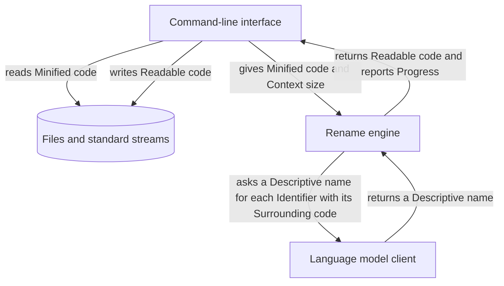
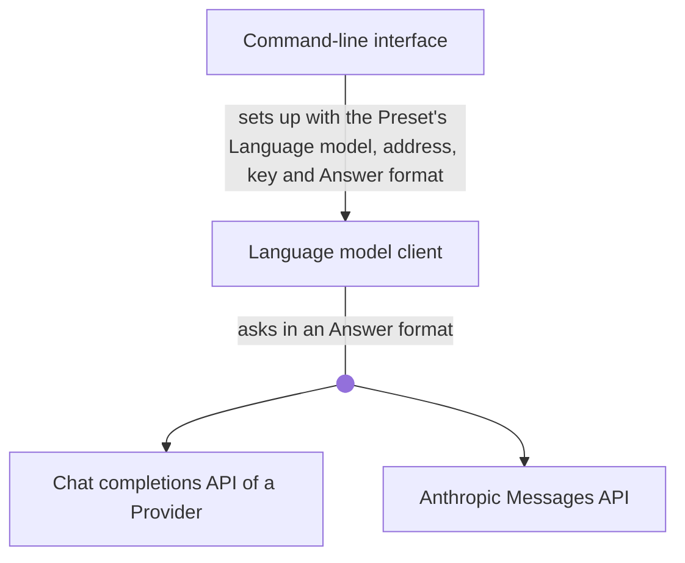

# Architecture

## Renaming Minified code

```mermaid
flowchart TD
  cli[Command-line interface]
  files[(Files and standard streams)]
  engine[Rename engine]
  client[Language model client]
  cli -- reads Minified code --> files
  cli -- gives Minified code and Context size --> engine
  engine -- asks a Descriptive name for each Identifier with its Surrounding code --> client
  client -- returns a Descriptive name --> engine
  engine -- returns Readable code and reports Progress --> cli
  cli -- writes Readable code --> files
```

## Asking the Language model

```mermaid
flowchart TD
  cli[Command-line interface]
  client[Language model client]
  ask@{ shape: f-circ }
  chat[Chat completions API of a Provider]
  messages[Anthropic Messages API]
  cli -- sets up with the Preset's Language model, address, key and Answer format --> client
  client -- asks in an Answer format --- ask
  ask --> chat & messages
```
